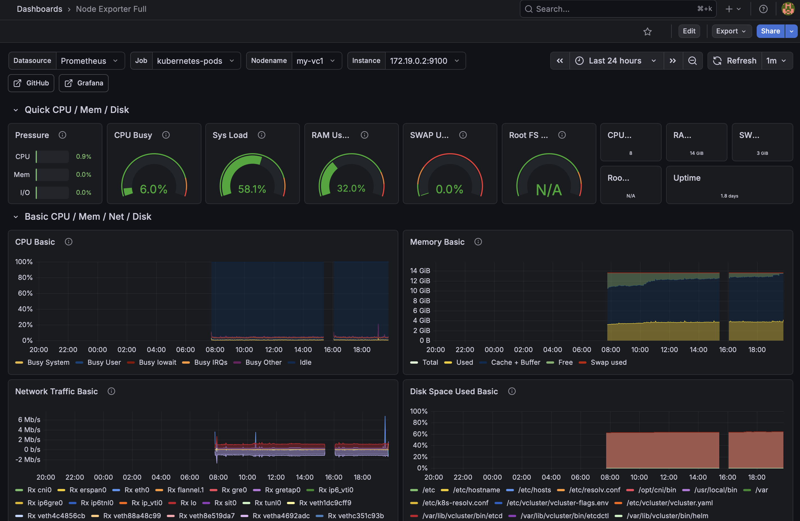
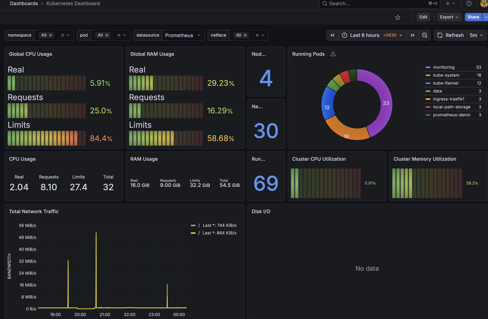
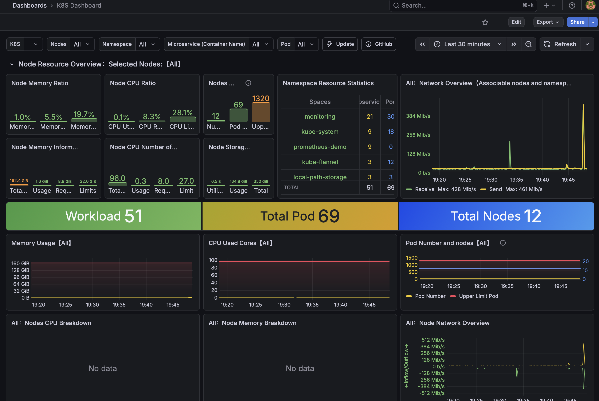
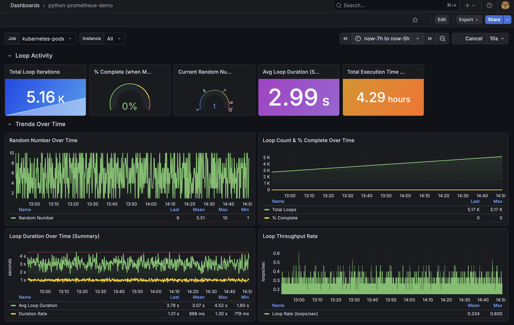
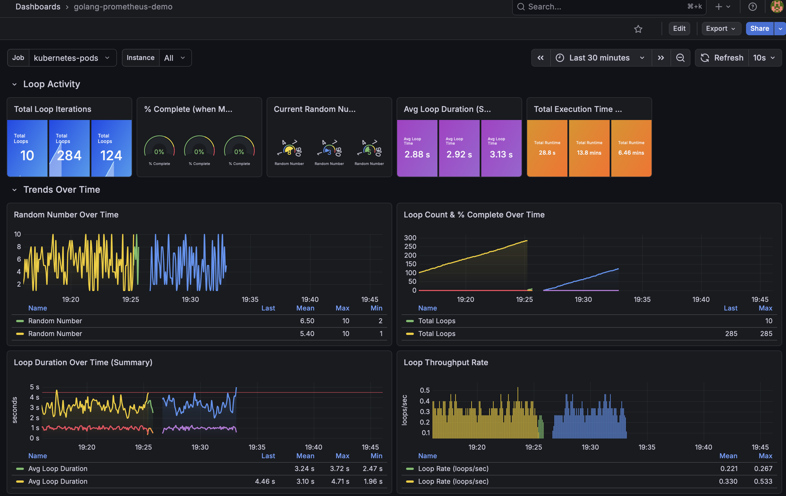
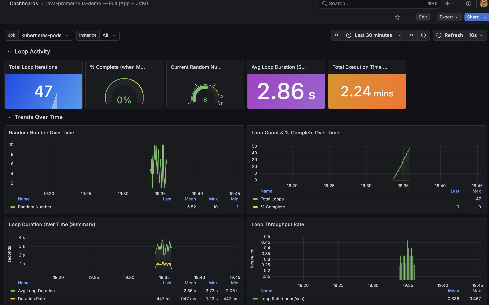

## Dashboard Examples

Below are some examples dashboards visualizing the metrics expose via K8S cluster, node export and our application specific.

### Node_Exporter

### K8S - #1

### K8S - #2

### PythonApp

### GolangApp

### JavaApp

