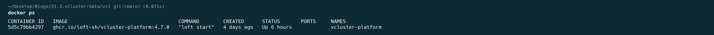
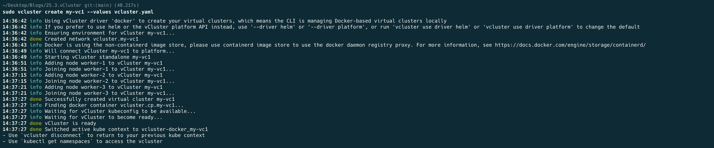
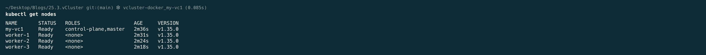
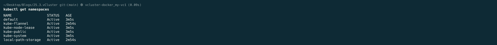
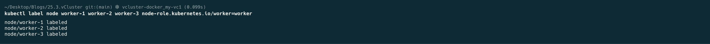
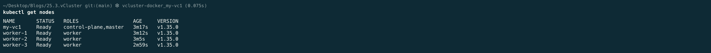
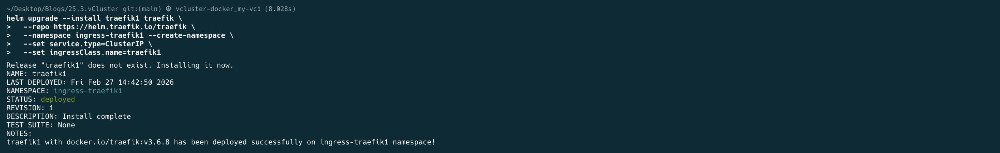

## Multi Node Kubernetes cluster on vCluster, single Traefik Application Proxy and seperate Ingress's Controllers

## Step 1. Create a vCluster in Docker (automatically connects)

Pre Deployment




```bash
# while located in the monitoring directory, execute

sudo vcluster create my-vc1 --values vcluster.yaml
```


## Step 2. Verify it's working

```bash
kubectl get nodes
kubectl get namespaces
```





Lets Label our nodes correctly, little attention to detail

```bash
kubectl label node worker-1 worker-2 worker-3 node-role.kubernetes.io/worker=worker
```


Notice the difference.

```bash
kubectl get nodes
```



## STEP 3: Install Traefik open-source HTTP Application/Reverse proxy 

```bash
echo "Installing Traefik with ClusterIP..."

helm upgrade --install traefik1 traefik \
  --repo https://helm.traefik.io/traefik \
  --namespace ingress-traefik1 --create-namespace \
  --set service.type=ClusterIP \
  --set ingressClass.name=traefik1
```



By using a ClusterIP it allows us to run one kubectl port-forward onto the cluster, through which we can then access all the services exposed.


## STEP 4: Deploy our Monitoring Stack.

So I'm using [Manifest](https://en.wikipedia.org/wiki/Manifest_file) files on purpose, it's easier to read and easier to follow how things are are plugged together.

Nothing stopping you from doing the below using one of the various [HELM](https://helm.sh) deploy guides. I actually include some references in `monitoring/README.md `for deploying the stack using HELM chart deployment option.

**NOTE**: [Traefik](https://traefik.io/traefik) was deployed above as part of the cluster build using an [HELM](https://helm.sh) chart.

Enough talkng, **LETS Deploy**, Start by reading `monitoring/Deploy_monitoring.md`, after which each of the subdirectories below as show you will notice include a `README.md`.
