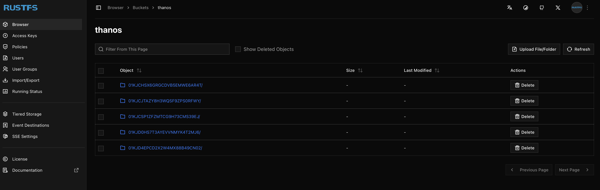

## RustFS

### What it is

RustFS is a Rust-based S3-compatible object store (similar to MinIO). It serves two roles in this stack:

1. **S3 API (port 9000)** — used by the Thanos sidecar to ship Prometheus TSDB blocks every 2h, and by Thanos Store Gateway and Compactor to read historical data
2. **Console UI (port 9001)** — a Next.js web UI for browsing buckets and objects

### Namespace

`data`

### Credentials

Stored in `1.rustfs-secret.yaml` as a Kubernetes Secret.

- Access Key: `rustadmin`
- Secret Key: `rustadmin`

### Storage

Two hostPath PersistentVolumes on the node:

- `/data/rustfs/data` (10Gi) — object data
- `/data/rustfs/logs` (1Gi) — log files

### Bucket

A `thanos` bucket is created at deploy time by a one-off Job (`thanos/1.thanos-create-bucket.yaml`) using the MinIO `mc` client.

### Known Limitations

- Running as `runAsUser: 0` (root) — required by this alpha build
- Using TCP probes instead of HTTP probes — the HTTP health endpoint is not reliable in this alpha version
- Console UI (`1.0.0-alpha.83`) has a redirect bug where it issues a bare `/browser` redirect instead of `/rustfs/console/browser`, causing a redirect loop in Chrome/Safari. **Use Firefox** to access the console

### Access

Via Traefik port-forward on port 9001:

```
kubectl port-forward service/traefik1 -n ingress-traefik1 9001:9001
http://localhost:9001/rustfs/console/index.html   ← Firefox only
```

S3 API is available internally at:
```
http://rustfs-service.data.svc.cluster.local:9000
```

### Files

| File | Purpose |
|------|---------|
| `1.rustfs-secret.yaml` | Access/secret key credentials |
| `2.rustfs-volumes.yaml` | PV + PVC for data and logs |
| `3.rustfs-deployment.yaml` | Deployment with TCP probes |
| `4.rustfs-service.yaml` | ClusterIP service on ports 9000 and 9001 |


## Deployment

### Prequitistes

First we need to make sure we have our required namespaces.

This can be done by executing:

```bash
kubectl apply -f monitoring/namespaces.yaml
```

## Deploying RustFS stack

Followed by executing the below from inside the `monitoring/rustfs` directory,

```bash
cd monitoring/rustfs
kubectl apply -f .
```

## Thanos Aging metrics from Prometheus TSDB into RustFS, Thanos bucket


